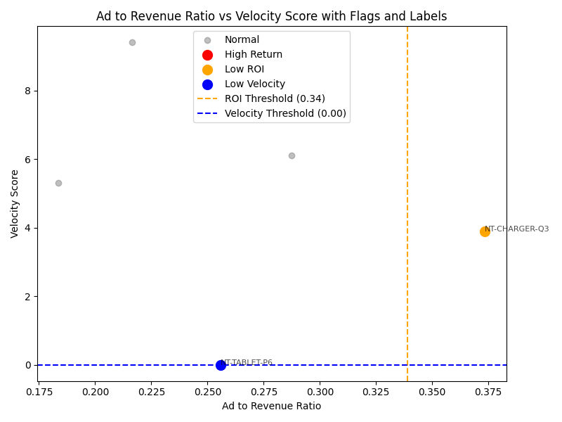
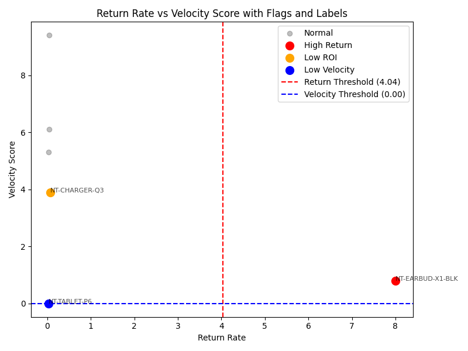

## **Analytical Approach**

When I started exploring the dataset, I began by **manually reviewing all the CSV files** to understand what kind of data was available — things like product details, inventory levels, ad spend, and performance metrics.  
This helped me get a sense of how the data connected and what kind of insights I could extract.

While exploring, I noticed that **some numeric columns had missing or null values**.  
Since these could cause issues during calculations and merging, I decided to **replace all null values with `0`**.  
This ensured the data remained consistent and wouldn’t break while performing operations later.

---

## **Data Cleaning**

The first step was to **handle missing values**.  
Any column that contained `null` values — such as sales, inventory, or ad spend — was replaced with `0`.  
I did this because leaving them as nulls could lead to incorrect KPI calculations or errors during joins and aggregations.

By doing this early, I made sure the rest of the analysis would run smoothly without manual exceptions.

---

## **Data Merging and Summary Creation**

Once the data was cleaned, I started thinking about how to **combine these different CSV files** to create meaningful summaries.

- For inventory, I **merged the product catalog** with **inventory movement data** to create a **stock summary**.  
  This gave me visibility into **current inventory levels per product**.

- For marketing, I **joined the advertising spend data** with **performance metrics** to create an **ad summary**.  
  This helped analyze how each product’s ad spend translated into conversions and revenue.

This merging step laid the foundation for calculating key metrics across the entire dataset.

---

## **KPI Calculations**

With the merged data ready, I defined a few **Key Performance Indicators (KPIs)** that could reveal important insights about product performance.

Here’s my thought process:

- **Return Rate**  
  I wanted to identify if some products were being returned frequently, as that could point to **quality issues** or **customer dissatisfaction**.  
  So I calculated this as `Returns ÷ Units Shipped`.

- **Advertising Spend Efficiency**  
  Since marketing is a big cost driver, I checked **how effectively ad spend turned into revenue** using `Ad Spend ÷ Revenue`.  
  This showed which products had strong or weak ROI.

- **Sales Velocity**  
  To understand product demand, I looked at **how fast each product was selling relative to its inventory**.  
  This helped distinguish **fast-moving** from **slow-moving** items.

---

## **Adaptive Thresholds**

Rather than setting arbitrary cutoffs to classify performance, I wanted something more **data-driven**.  
So, I used **quantile-based thresholds** (percentiles) to flag products that were performing unusually **well** or **poorly**.  

This approach adapts to the data’s distribution — making it more fair and reflective of real performance differences.

---

## **Key Discoveries**

After calculating the KPIs, a few patterns stood out clearly:

- **Stockouts** — Some products often ran out of stock, which likely led to **lost sales** and missed revenue.
- **High Return Rates** — A few SKUs had **very high return ratios**, hinting at possible **quality problems** or **incorrect listings**.
- **Inefficient Ad Spend** — Certain products had **high marketing spend but low revenue**, suggesting **budget inefficiencies**.
- **Variable Sales Velocity** — Some products sold extremely fast, while others were stagnant, tying up inventory and cash flow.

These discoveries highlighted where business attention was needed most.

---

## **Assumptions**

While performing the analysis, I made a few key assumptions to keep things consistent:

- **Missing Data Handling:** All missing numeric values were treated as `0`, assuming absence means no data rather than unknown.  
- **Adaptive Thresholds:** Quantile-based thresholds better represented the natural variability in data.  
- **Inventory Interpretation:** A value of `0` or null in inventory was treated as a **stockout**, not a missing record.

These assumptions helped maintain clarity and consistency throughout the analysis.

---

## **AI Usage Disclosure**

I used **AI tools** to help **structure the analysis**, **draft content**, and generate some **code snippets** for cleaning and merging.  
However, **all core analysis, validation, and interpretations** were done manually to ensure **accuracy and business relevance**.  

I also made sure to **document the meaning of each column** during exploration to avoid misinterpretation later.

---

## **Future Enhancements & Recommendations**

Looking ahead, here’s how this analysis could be improved further:

- **Automate Data Pipelines**  
  Set up pipelines to automatically pull and process new data so KPIs update in real time.

- **Integrate Customer Feedback**  
  Include reviews and sentiment data to connect **return rates** with **customer opinions**.

- **Predictive Modeling**  
  Build machine learning models to **forecast demand**, **predict stockouts**, and **flag at-risk SKUs** early.

- **Inventory Optimization**  
  Use KPI insights to optimize **reorder levels** and **stock allocation**.

- **Interactive Dashboards**  
  Visualize KPIs and insights through **real-time dashboards** for quick decision-making.

## **Output Visualizations**

Below are the visual plots generated from the analysis to highlight key insights based on the calculated KPIs:

### **1. Ad to Revenue Ratio vs Velocity Score**

This plot shows how efficiently each product converts advertising spend into revenue relative to its sales velocity.  
- **Low ROI (orange)** points indicate products with high ad spend but low revenue.  
- **Low Velocity (blue)** points represent slow-moving items.  
- The **ROI Threshold (0.34)** and **Velocity Threshold (0.00)** are adaptive percentiles used to flag underperforming SKUs.

---

### **2. Return Rate vs Velocity Score**

This plot compares **return rates** against **sales velocity** to identify products with potential quality or satisfaction issues.  
- **High Return (red)** points signal possible product issues.  
- **Low Velocity (blue)** points show slow-moving items.  
- The **Return Threshold (4.04)** and **Velocity Threshold (0.00)** are used to mark outliers.

